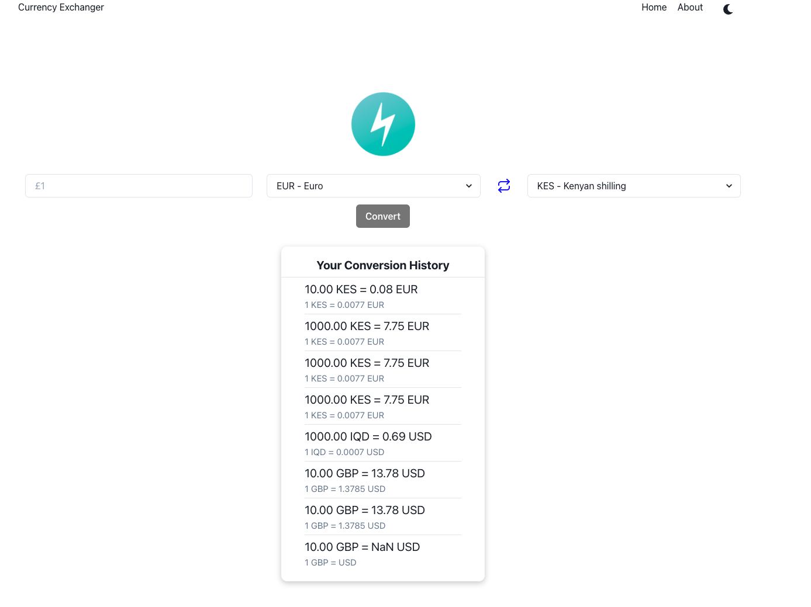

# Currency Converter
This project converts currencies amount from one currency to another

## API
This project uses [Currency API](https://currency.getgeoapi.com/) to:
- Get list of supported currencies
- Convert currencies

## Technologies used & Requirements
This project requires:

    - Node js atleast version ^10
    - Yarn version ^1
    - Any Preferable OS - windows, unix, etc

Technologies used:

    - Typescript
    - React JS library
    - Chakra UI
    - Redux
    - Formik
    - Axios - promised based HTTP client
    - uuid - Generate RFC-compliant UUIDs in JavaScript

## Secret Keys
Create a `.env` file and add the following key variables:
```
REACT_APP_BASE_URL=https://api.getgeoapi.com/v2/currency/
REACT_APP_API_KEY=1e15f225b198772d5bab9b02791f1646c3a310fc
```
## How To Test (Locally)
    - Clone this repo
    - `cd currency-converter`
    - on the terminal, install dependencies, `yarn`
    - Run the server locally, `yarn start`

## Hosting
This project is hosted on Netlify. You can access [here](https://currency-exchangeer.netlify.app)

## Features

    - Convert currencies
    - List currencies supported by the API
    - Currency convertion history
    - About page

## Inspiration
This project was inspired by [Codahead](https://codahead.com/).

## Screenshot(s)



## Improvements
- Types - Due to time limit, I was able to fully add the specific types for variables
- UI - Good UI/UX
- Site responsiveness - support all devices
